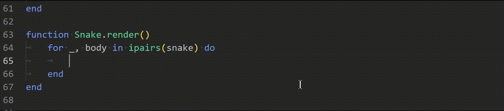
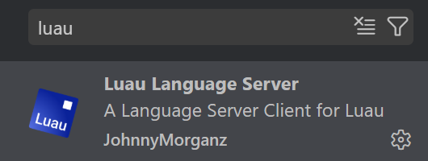
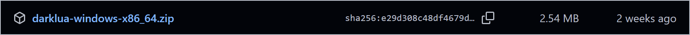
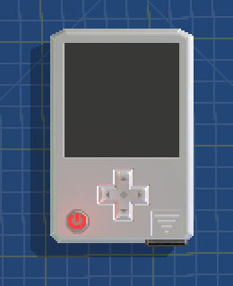
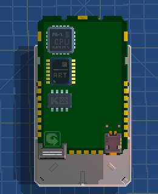
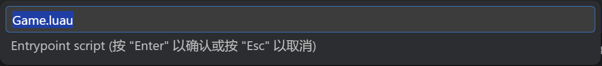

Language: [English](README.md) | **简体中文**

# RetroGadgets 编码流程

你是不是总觉得在 RetroGadgets 里写代码非常受限？
当你要实现复杂的功能时，往往需要拆分成多个文件来管理代码，而你却对 RetroGadgets 的内置资源管理器非常失望（没有文件夹、无法排序）。
或者你更倾向于使用现代 IDE 来编写代码。

那么这里我总结了一套自己的一套编码流程，能够让你在 VSCode 中高效地编写代码，并轻松将代码同步地导入到 RetroGadgets 中。

## 概述

* 使用 VSCode + Luau-LSP 实现正确的语法高亮和自动补全
* IDE支持多个文件/文件夹（不再局限于单个1000行的文件）
* darklua 将所有内容打包成一个 CPU0.lua 文件 - 只需复制粘贴到游戏中即可



## 准备工作

> [!Note]
> 我假定大家使用的操作系统都是 Windows

### VSCode

首先，去官网安装 [Visual Studio Code (VSCode)](https://code.visualstudio.com/)
，
这将作为我们编写代码的主要 IDE。

安装完成并打开软件后，去侧边栏找"拓展"窗口（你也可以通过默认快捷键 Ctrl+Shift+X 呼出），搜索 "Luau"，
然后安装这个插件： [Luau Language Server (by JohnnyMorganz)](https://github.com/JohnnyMorganz/luau-lsp)，确保插件启动。



### darklua

[darklua](https://darklua.com/) 是一个用于预处理 lua 代码的软件，而我们将会用到它的捆绑代码(bundle code)功能。

去官方 github 仓库上下载已发布的版本，链接：https://github.com/seaofvoices/darklua/releases/，这里我们直接下载最新版本的压缩包。



下载完成后，将压缩包`darklua-windows-x86_64.zip`里面的可执行文件放到合适的位置，我这里就放在`D:/darklua/darklua.exe`里。

接下来编辑系统的环境变量，将`D:/darklua`添加到系统变量 Path 中。打开 cmd，输入命令`darklua --version`，如果能识别到命令即安装成功。

```cmd
C:\Users\**>darklua --version
darklua 0.18.0
```

### 创建项目

去 VSCode 里创建一个项目文件夹，这个文件夹只管理我们的 Lua 脚本。

文件(F) > 打开文件夹 > 这里我选择`D:/scripts`，这样将打开新的窗口并进入项目工作区。

把 luau 定义文件[`RetroGadgets.d.lua`](template/RetroGadgets.d.lua)和 darklua 的配置文件[`darklua.json`](template/darklua.json)拷贝到项目中，接下来修改 VSCode 插件配置：

管理  > 设置 > 工作区 > 搜索设置：`luau-lsp.types.definitionFiles` > 添加项目，键：`RetroGadgets` 值：`RetroGadgets.d.lua`

修改完成后，右下角会弹出"Reload language server"的提示，点击刷新即可应用配置。你也可以手动刷新：默认快捷键Ctrl+Shift+p 输入 `>luau: Reload Language Server`

系统会为你创建一个`.vscode`目录，此时再将配置文件[`tasks.json`](tasks.json)拷贝到你项目的`.vscode`文件夹中。

补充：

* 最好将配置选项`luau-lsp.sourcemap.enabled`关闭，不然luau-lsp会报找不到sourcemap相关的错误。
* 配置选项`luau-lsp.platform.type`改成`standard`，因为我们并不在 roblox 平台。

## 开始创作

如果按照上述步骤配置完成后，那么目前的资源管理器目录应该是这样的：

```
📁 D:/scripts
├── 📁 .vscode
│   ├── 📝 settings.json
│   └── 📝 tasks.json
├── 📝 darklua.json
└── 📄 RetroGadgets.d.lua
```

那么现在就去 RetroGadgets 游戏中创建一个用于测试的 Gadget。





如你所见，它仅有以下装置：

* PowerButton
* Screen0
* DPad0
* CPU0
* VideoChip0
* KeyboardChip0

当然我们并不关心这些，只需要知道代码该如何组织和导入即可，那么我这里已经有了一些代码示例（你可能会看到一些匪夷所思的代码，没错，这只是用于演示 XD），详见 [scripts](scripts) 文件夹：

* Food.luau
* Game.luau
* Map.luau
* Snake.luau
* folder/Utils.luau

你可以直接拷贝到你自己的项目中，或者自己写一些，通过右键 > 新建文件，以`.lua`为后缀。

示例的目录结构如下：

```
📁 D:/scripts
├── 📁 .vscode
│   ├── 📝 settings.json
│   └── 📝 tasks.json
├── 📁 folder
│   └── 📄 Utils.luau
├── 📝 darklua.json
├── 📄 Food.luau
├── 📄 Game.luau
├── 📄 Map.luau
├── 📄 RetroGadgets.d.lua
└── 📄 Snake.luau
```

<!-- 写完代码后，打开 cmd 并重定向到项目目录`cd /d D:/scripts`，再输入命令`darklua process --config darklua.json "Game.luau" "CPU0.lua"`，其中`Game.luau`应该替换成你的入口脚本文件。 -->

写完代码后，按下默认按键 Ctrl+Shift+B 或者手动执行`>tasks: Run Build Task`，会弹出 task 面板。



darklua 会为你生成一个整合后的`CPU0.lua`文件到你的项目中，将该文件里的内容拷贝到你的 Gadget 的`CPU0.lua`中，即可运行测试。

> [!WARNING]
> 脚本在`require`的时候应该尽量避免副作用，正如官方文档里所说：https://darklua.com/docs/bundle/
> 
> it is important that each module do not have any side effects at require-time, as the order of those side effects may not be preserved in the bundled code.
>
> [!TIP]
> 不会要有循环引用、不要在函数体中出现`require`

之后每一次修改代码后只需要重新生成一次`CPU0.lua`并替换游戏内代码即可。

## 最后

示例 Gadget 在创意工坊，叫"CodingFlowExample"。

感谢你看到这里，如果这对于组织管理你的项目有帮助的话，可以点个star~

`RetroGadgets.d.lua`里的定义如果有缺失或者有其它问题的话可以随时提出issue，也欢迎poll request。
